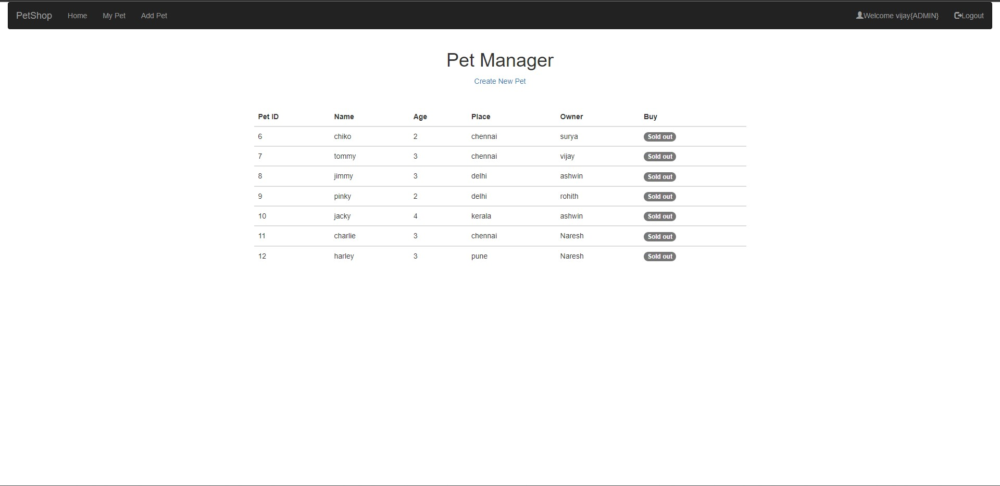

# Petshop-SpringSecurity

## FrontEnd
  - Java
## Backend
  - Mysql

## Frameworks
   - Bootstrap 3
   - Spring Boot
   - Spring Security
  ---

## Pages
 ### 1.Login
 ### 2.Logout
 ### 3.Add pet
 ### 4.My Pet
 ### 5.Buy Pet
 ### 6.User Profile
--- 
## Features 
  ### - User can register based on Roles
            - User
            - Admin
  ### - Custom Login Using Spring Security
  ### - Implemented Authentication and Authorization using spring security
  ### - Implemented Validation for Input Fields
  ### - Only Admin can add the pet
  ### - Admin can update the Profile
  ### - User can buy the pet and sell the pet
  ### - Admin can buy the pet and sell the pet
  ### - User and Admin can view their own pet in Mypet page
  
 ---
## Todo
  - [ ] Improve User Interface
  - [ ] Implement Java 8 Concepts
  - [ ] Implement Swagger Ui
  - [ ] Implement MicroService
  - [ ] Implement JWT Concept
  - [ ] Implement SonarQube

## Home Page

 
  
